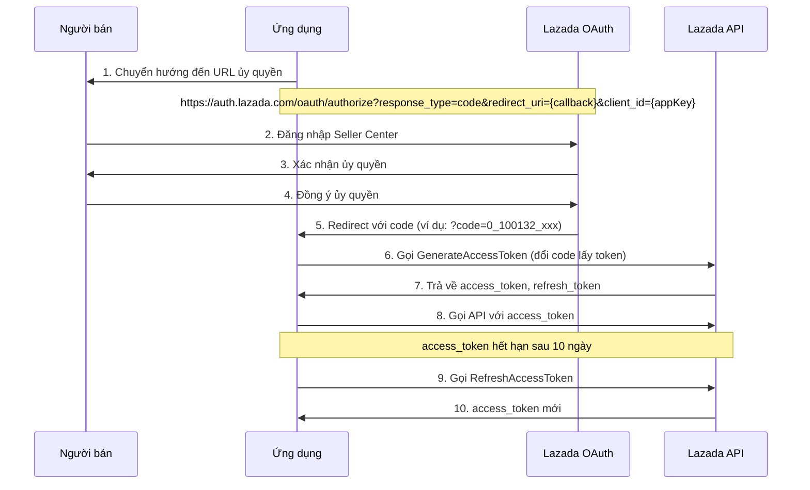
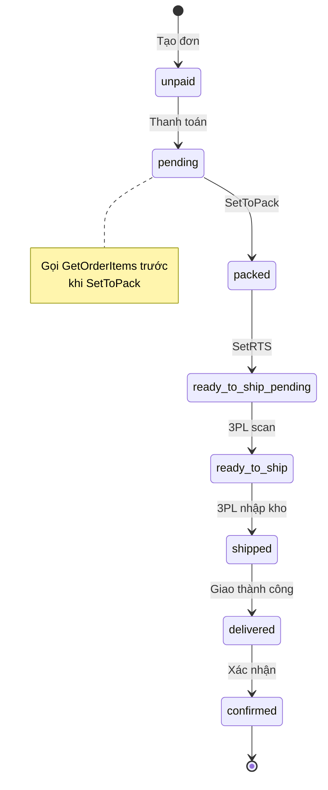
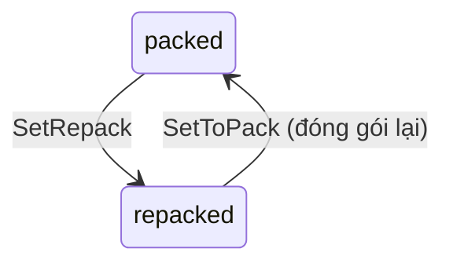
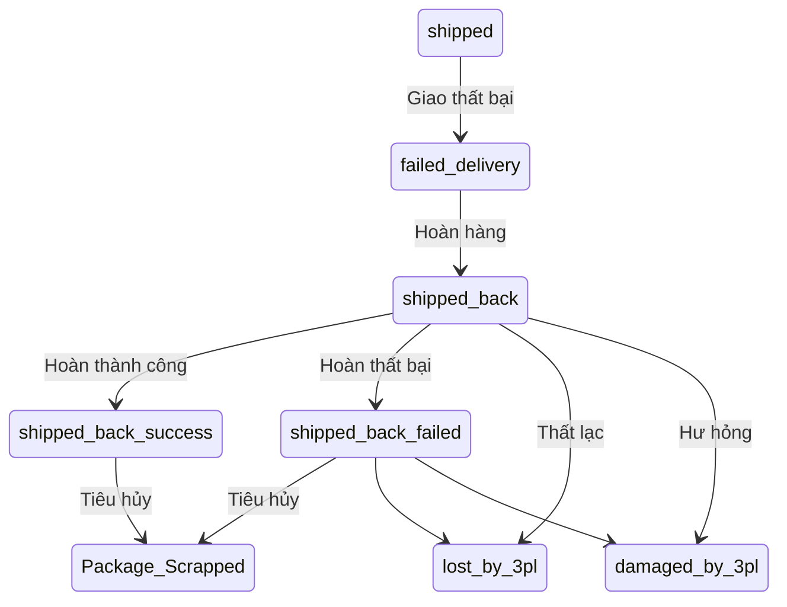
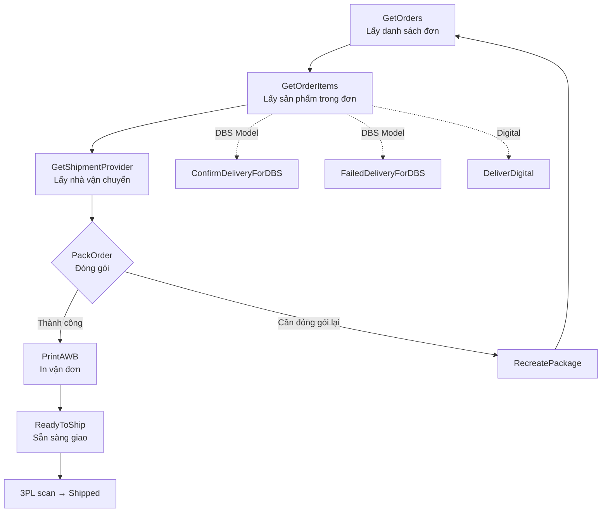

# 📦 Lazada API Client — Tài liệu tham khảo đầy đủ

> **Phiên bản:** 1.0  
> **Mục đích:** Tài liệu tổng hợp tất cả API của Lazada Open Platform dành cho việc tích hợp vào hệ thống.

---

## 📑 Mục lục

- [📦 Lazada API Client — Tài liệu tham khảo đầy đủ](#-lazada-api-client--tài-liệu-tham-khảo-đầy-đủ)
  - [📑 Mục lục](#-mục-lục)
  - [1. Xác thực \& Ủy quyền (Authorization)](#1-xác-thực--ủy-quyền-authorization)
    - [1.1 Luồng OAuth2](#11-luồng-oauth2)
    - [1.2 Service Endpoint](#12-service-endpoint)
    - [1.3 Authorization URL](#13-authorization-url)
    - [1.4 Tham số Authorization URL](#14-tham-số-authorization-url)
    - [1.5 Generate Access Token](#15-generate-access-token)
    - [1.6 Tham số Response](#16-tham-số-response)
  - [2. Quản lý Đơn hàng (Order)](#2-quản-lý-đơn-hàng-order)
    - [⚙️ Common Parameters (cho tất cả API)](#️-common-parameters-cho-tất-cả-api)
    - [2.1 GetOrders — Lấy danh sách đơn hàng](#21-getorders--lấy-danh-sách-đơn-hàng)
      - [Request Parameters](#request-parameters)
      - [Response Structure](#response-structure)
      - [`LazadaOrderDetail` Fields](#lazadaorderdetail-fields)
    - [2.2 GetOrder — Lấy chi tiết một đơn hàng](#22-getorder--lấy-chi-tiết-một-đơn-hàng)
      - [Request Parameters](#request-parameters-1)
      - [Response](#response)
    - [2.3 GetOrderItems — Lấy sản phẩm trong đơn](#23-getorderitems--lấy-sản-phẩm-trong-đơn)
      - [Request Parameters](#request-parameters-2)
      - [Response Structure](#response-structure-1)
    - [2.4 GetMultipleOrderItems — Lấy sản phẩm nhiều đơn](#24-getmultipleorderitems--lấy-sản-phẩm-nhiều-đơn)
      - [Request Parameters](#request-parameters-3)
      - [Response Structure](#response-structure-2)
    - [📋 OrderItem — Chi tiết sản phẩm (dùng chung)](#-orderitem--chi-tiết-sản-phẩm-dùng-chung)
      - [🔑 Định danh](#-định-danh)
      - [💰 Giá cả](#-giá-cả)
      - [🚚 Vận chuyển](#-vận-chuyển)
      - [🎫 Voucher \& Credits](#-voucher--credits)
      - [📌 Trạng thái \& Fulfillment](#-trạng-thái--fulfillment)
      - [🎁 Digital \& Gift](#-digital--gift)
      - [↩️ Hủy / Trả hàng](#️-hủy--trả-hàng)
      - [📅 Thời gian](#-thời-gian)
      - [👤 Buyer / Other](#-buyer--other)
    - [2.5 GetShipmentProviders — Lấy nhà vận chuyển](#25-getshipmentproviders--lấy-nhà-vận-chuyển)
    - [2.6 PackOrder — Đóng gói đơn hàng](#26-packorder--đóng-gói-đơn-hàng)
    - [2.7 RecreatePackage — Đóng gói lại](#27-recreatepackage--đóng-gói-lại)
    - [2.8 PrintAWB — In vận đơn](#28-printawb--in-vận-đơn)
    - [2.9 GetShippingLabel — In nhãn vận chuyển (V2)](#29-getshippinglabel--in-nhãn-vận-chuyển-v2)
    - [2.10 ReadyToShip — Sẵn sàng giao hàng](#210-readytoship--sẵn-sàng-giao-hàng)
    - [2.11 TraceOrder — Tra cứu vận chuyển](#211-traceorder--tra-cứu-vận-chuyển)
    - [2.12 ConfirmDeliveryForDBS — Xác nhận giao hàng (DBS)](#212-confirmdeliveryfordbs--xác-nhận-giao-hàng-dbs)
    - [2.13 FailedDeliveryForDBS — Xác nhận giao thất bại (DBS)](#213-faileddeliveryfordbs--xác-nhận-giao-thất-bại-dbs)
  - [3. Vòng đời đơn hàng (Order Lifecycle)](#3-vòng-đời-đơn-hàng-order-lifecycle)
    - [3.1 Danh sách trạng thái](#31-danh-sách-trạng-thái)
    - [3.2 Luồng xử lý chính (Happy Path)](#32-luồng-xử-lý-chính-happy-path)
    - [3.3 Luồng đóng gói lại (Repack Loop)](#33-luồng-đóng-gói-lại-repack-loop)
    - [3.4 Luồng giao hàng thất bại](#34-luồng-giao-hàng-thất-bại)
    - [3.5 Quy trình gọi API theo thứ tự](#35-quy-trình-gọi-api-theo-thứ-tự)
    - [3.6 Business Rules](#36-business-rules)
  - [4. Phương thức thanh toán (Payment Options)](#4-phương-thức-thanh-toán-payment-options)
    - [4.1 Theo quốc gia](#41-theo-quốc-gia)
  - [5. Mã lỗi (Error Codes)](#5-mã-lỗi-error-codes)
    - [5.1 GetOrders / GetOrder](#51-getorders--getorder)
    - [5.2 GetMultipleOrderItems](#52-getmultipleorderitems)
    - [5.3 General Errors](#53-general-errors)
  - [🔗 File tham chiếu](#-file-tham-chiếu)

---

## 1. Xác thực & Ủy quyền (Authorization)

### 1.1 Luồng OAuth2

Lazada Open Platform sử dụng giao thức **OAuth2.0** với cơ chế **code-for-token**.



### 1.2 Service Endpoint

| Region | Endpoint |
|--------|----------|
| All countries (SG/MY/TH/VN/ID/PH) | `https://auth.lazada.com/` |

### 1.3 Authorization URL

```
https://auth.lazada.com/oauth/authorize?response_type=code&force_auth=true&redirect_uri=${callback}&client_id=${appKey}
```

### 1.4 Tham số Authorization URL

| Parameter | Required | Demo | Description |
|-----------|----------|------|-------------|
| `client_id` | ✅ Yes | `101406` | APPKEY tạo từ Lazada Console |
| `redirect_uri` | ✅ Yes | `https://lazada.com` | Callback URL nhận authorization code |
| `response_type` | ✅ Yes | `code` | Loại ủy quyền, giá trị cố định `code` |
| `state` | ❌ No | `123456` | Custom field, sẽ gửi lại cùng code |

### 1.5 Generate Access Token

**API:** `POST /auth/token/create`

**Request mẫu:**

```
https://auth.lazada.com/rest/auth/token/create?code={code}&app_key={appKey}&sign_method=sha256&timestamp={timestamp}&sign={sign}
```

**Response mẫu:**

```json
{
  "access_token": "50000201f12dgccvfLzTimgL1c1c4dd8h0irs9DWCORDQqXRlsvWgpDt5x4Fwy",
  "country": "sg",
  "refresh_token": "50001201e12pmXdgResRzjif112e3a46Kl0eqskC0iRRhLQXprmWX5QElsqQOK",
  "account_platform": "seller_center",
  "refresh_expires_in": 4320000,
  "country_user_info": [
    {
      "country": "sg",
      "user_id": "1152180742",
      "seller_id": "1152180742",
      "short_code": "SGLYT0OS"
    }
  ],
  "expires_in": 864000,
  "account": "LzdOp_SG_test@163.com",
  "code": "0",
  "request_id": "212a6a5a17675956955215662"
}
```

### 1.6 Tham số Response

| Parameter | Type | Description |
|-----------|------|-------------|
| `access_token` | String | Token gọi Lazada API, mỗi store một token riêng |
| `expires_in` | Number | Số giây token còn hiệu lực (VD: 864000 = 10 ngày) |
| `refresh_token` | String | Dùng để refresh access_token khi hết hạn |
| `refresh_expires_in` | Number | Số giây refresh_token còn hiệu lực (VD: 4320000 = 50 ngày) |
| `country` | String | Mã quốc gia (`sg`, `my`, `ph`, `th`, `id`, `vn`, `cb`) |
| `account_platform` | String | `seller_center` |
| `country_user_info` | Object[] | Danh sách store được ủy quyền |
| `account` | String | Email người bán |

---

## 2. Quản lý Đơn hàng (Order)

### ⚙️ Common Parameters (cho tất cả API)

Các tham số chung được tự động thêm bởi `buildBasePayload()` trong code:

| Parameter | Type | Required | Description |
|-----------|------|----------|-------------|
| `app_key` | String | ✅ Yes | App Key từ Lazada Console |
| `timestamp` | String | ✅ Yes | Timestamp, chênh lệch < 7200s so với UTC |
| `access_token` | String | ✅ Yes | Token ủy quyền |
| `sign_method` | String | ✅ Yes | `sha256` |
| `sign` | String | ✅ Yes | Chữ ký HMAC-SHA256 |

---

### 2.1 GetOrders — Lấy danh sách đơn hàng

> **Endpoint:** `GET /orders/get`  
> **Module:** [`getOrders()`](packages/lazada-api-client/src/module/lazada/api/order.api.ts:64)  
> **Request DTO:** [`GetOrdersRequest`](packages/lazada-api-client/src/module/lazada/dto/request/order.request.ts:5)  
> **Response DTO:** [`LazadaResponseGetOrders`](packages/lazada-api-client/src/module/lazada/dto/response/order.response.ts:153)

#### Request Parameters

| Parameter | Type | Required | Description |
|-----------|------|----------|-------------|
| `created_after` | String | ⚠️ * | ISO 8601, filter đơn tạo sau thời điểm này |
| `created_before` | String | ❌ No | ISO 8601, filter đơn tạo trước thời điểm này |
| `update_after` | String | ⚠️ * | ISO 8601, filter đơn cập nhật sau thời điểm này |
| `update_before` | String | ❌ No | ISO 8601, filter đơn cập nhật trước thời điểm này |
| `status` | String | ❌ No | Filter theo status: `unpaid`, `pending`, `canceled`, `ready_to_ship`, ... |
| `sort_direction` | Enum | ❌ No | `ASC` hoặc `DESC` |
| `sort_by` | Enum | ❌ No | `created_at` hoặc `updated_at` |
| `offset` | Number | ❌ No | Số bản ghi bỏ qua (max: 5000) |
| `limit` | Number | ❌ No | Số bản ghi tối đa (max: 100) |

> ⚠️ * Bắt buộc có ít nhất một trong hai: `update_after` hoặc `created_after`

#### Response Structure

```json
{
  "code": "0",
  "request_id": "abc123",
  "data": {
    "countTotal": 150,
    "count": 100,
    "orders": [
      { "...": "LazadaOrderDetail" }
    ]
  }
}
```

| Field | Type | Description |
|-------|------|-------------|
| `data.countTotal` | Number | Tổng số đơn hàng thỏa filter |
| `data.count` | Number | Số đơn trả về (đã tính offset & limit) |
| `data.orders[]` | Object[] | Danh sách đơn hàng |

#### `LazadaOrderDetail` Fields

| Field | Type | Description |
|-------|------|-------------|
| `order_id` | Number | ID đơn hàng |
| `order_number` | String | Order number |
| `created_at` | String | ISO 8601 |
| `updated_at` | String | ISO 8601 |
| `address_updated_at` | String | Thời gian cập nhật địa chỉ |
| `price` | String | Tổng tiền (chưa bao gồm voucher & ship) |
| `shipping_fee` | String | Phí ship thực tế |
| `shipping_fee_original` | String | Phí ship gốc |
| `shipping_fee_discount_seller` | String | Giảm phí ship từ seller |
| `shipping_fee_discount_platform` | String | Giảm phí ship từ platform |
| `voucher` | String | Tổng voucher |
| `voucher_platform` | String | Voucher từ Lazada |
| `voucher_seller` | String | Voucher từ seller |
| `voucher_code` | String | Mã voucher |
| `payment_method` | String | Phương thức thanh toán |
| `statuses` | String[] | Trạng thái các item trong đơn |
| `items_count` | Number | Số lượng sản phẩm |
| `gift_option` | String | `1` nếu là quà tặng |
| `gift_message` | String | Lời nhắn quà tặng |
| `warehouse_code` | String | Mã kho |
| `branch_number` | String | (Thái Lan) Mã chi nhánh thuế |
| `tax_code` | String | (Thái Lan/Việt Nam) Mã số thuế |
| `national_registration_number` | String | Số đăng ký quốc gia |
| `extra_attributes` | String | Thuộc tính mở rộng |
| `promised_shipping_times` | String | Thời gian giao hàng dự kiến |
| `delivery_info` | String | Thông tin giao hàng |
| `buyer_note` | String | Ghi chú người mua |
| `remarks` | String | Ghi chú |
| `customer_first_name` | String | Tên khách hàng |
| `customer_last_name` | String | Họ khách hàng |
| `need_cancel_confirm` | Boolean | Cần xác nhận hủy |
| `is_cancel_pending` | String | Đang chờ hủy |
| `address_shipping` | Object | Địa chỉ giao hàng (`AddressShipping`) |
| `address_billing` | Object | Địa chỉ thanh toán (`AddressBilling`) |
| `recipient_info` | Object | Thông tin người nhận (`RecipientInfo`) |

---

### 2.2 GetOrder — Lấy chi tiết một đơn hàng

> **Endpoint:** `GET /order/get`  
> **Module:** [`getOrderById()`](packages/lazada-api-client/src/module/lazada/api/order.api.ts:156)  
> **Request DTO:** [`GetOrderRequest`](packages/lazada-api-client/src/module/lazada/dto/request/order.request.ts:64)  
> **Response DTO:** [`LazadaResponseGetOrder`](packages/lazada-api-client/src/module/lazada/dto/response/order.response.ts:163)

#### Request Parameters

| Parameter | Type | Required | Description |
|-----------|------|----------|-------------|
| `order_id` | Number/String | ✅ Yes | Order ID từ Seller Center |

#### Response

```json
{
  "code": "0",
  "request_id": "abc123",
  "data": { "...": "LazadaOrderDetail" }
}
```

Response data là một object [`LazadaOrderDetail`](#lazadaorderdetail-fields) (giống GetOrders nhưng chỉ một đơn).

---

### 2.3 GetOrderItems — Lấy sản phẩm trong đơn

> **Endpoint:** `GET /order/items/get`  
> **Module:** [`getOrderItems()`](packages/lazada-api-client/src/module/lazada/api/order.api.ts:187)  
> **Request DTO:** [`GetOrderItemsRequest`](packages/lazada-api-client/src/module/lazada/dto/request/order.request.ts:74)  
> **Response DTO:** [`LazadaResponseGetOrderItems`](packages/lazada-api-client/src/module/lazada/dto/response/order.response.ts:386)

#### Request Parameters

| Parameter | Type | Required | Description |
|-----------|------|----------|-------------|
| `order_id` | Number/String | ✅ Yes | Order ID |

#### Response Structure

```json
{
  "code": "0",
  "request_id": "abc123",
  "data": {
    "items": [ { "...": "OrderItem" } ],
    "total": 5
  }
}
```

---

### 2.4 GetMultipleOrderItems — Lấy sản phẩm nhiều đơn

> **Endpoint:** `GET /orders/items/get`  
> **Module:** [`getMultipleOrderItems()`](packages/lazada-api-client/src/module/lazada/api/order.api.ts:215)  
> **Request DTO:** [`GetMultipleOrderItemsRequest`](packages/lazada-api-client/src/module/lazada/dto/request/order.request.ts:85)  
> **Response DTO:** [`LazadaResponseGetMultipleOrderItems`](packages/lazada-api-client/src/module/lazada/dto/response/order.response.ts:406)

#### Request Parameters

| Parameter | Type | Required | Description |
|-----------|------|----------|-------------|
| `order_ids` | String | ✅ Yes | List order ID dạng `"[123456,789012]"` (max 50) |

#### Response Structure

```json
{
  "code": "0",
  "request_id": "abc123",
  "data": [
    {
      "order_id": 123456,
      "order_number": 123456,
      "order_items": [ { "...": "OrderItem" } ]
    }
  ]
}
```

---

### 📋 OrderItem — Chi tiết sản phẩm (dùng chung)

> **Interface:** [`OrderItem`](packages/lazada-api-client/src/module/lazada/dto/response/order.response.ts:174)

#### 🔑 Định danh

| Field | Type | Description |
|-------|------|-------------|
| `order_item_id` | Number | ID của order item |
| `order_id` | Number | Order ID |
| `order_number` | Number | Order number |
| `shop_id` | Number | Shop ID |
| `item_id` | Number | Product item ID |
| `product_id` | String | Product ID |
| `sku_id` | String | SKU ID |
| `seller_sku` | String | Seller SKU |
| `shop_sku` | String | Shop SKU |
| `sku` | String | SKU |
| `name` | String | Tên sản phẩm |
| `variation` | String | Phân loại |
| `product_detail_url` | String | URL chi tiết sản phẩm |
| `product_main_image` | String | URL ảnh chính |
| `sku_image` | String | URL ảnh SKU |

#### 💰 Giá cả

| Field | Type | Description |
|-------|------|-------------|
| `original_price` | String | Giá gốc |
| `paid_price` | String | Giá đã thanh toán |
| `item_price` | String | Giá sản phẩm |
| `sku_original_price` | Number | Giá gốc SKU |
| `currency` | String | Mã tiền tệ (ISO 4217) |
| `tax_amount` | String | Số thuế |
| `tax_code` | String | Mã số thuế |
| `supply_price` | String | Giá cung ứng (MP3) |
| `supply_price_currency` | String | Tiền tệ giá cung ứng |

#### 🚚 Vận chuyển

| Field | Type | Description |
|-------|------|-------------|
| `shipping_fee` | String | Phí vận chuyển |
| `shipping_fee_original` | String | Phí ship gốc |
| `shipping_fee_discount_seller` | String | Giảm từ seller |
| `shipping_fee_discount_platform` | String | Giảm từ platform |
| `shipping_amount` | String | Phí ship |
| `shipping_service_cost` | Number | Chi phí dịch vụ ship |
| `shipping_type` | String | `Drop-shipping` hoặc `Warehouse` |
| `shipping_provider_type` | String | `Express`, `Standard`, `Economy`, v.v. |
| `shipment_provider` | String | Nhà vận chuyển |
| `tracking_code` | String | Mã tracking |
| `tracking_code_pre` | String | Tracking code (không dùng) |
| `tracking_number` | String | Số tracking |
| `package_id` | String | ID kiện hàng |

#### 🎫 Voucher & Credits

| Field | Type | Description |
|-------|------|-------------|
| `voucher` | String | Tổng voucher |
| `voucher_amount` | String | Số tiền voucher |
| `voucher_platform` | String | Voucher từ Lazada |
| `voucher_seller` | String | Voucher từ seller |
| `voucher_code` | String | Mã voucher |
| `voucher_code_seller` | String | Mã voucher từ seller |
| `voucher_code_platform` | String | Mã voucher từ platform |
| `wallet_credits` | String | Credits từ ví |
| `voucher_seller_lpi` | String | Lazada Bonus từ seller |
| `voucher_platform_lpi` | String | Lazada Bonus từ Lazada |

#### 📌 Trạng thái & Fulfillment

| Field | Type | Description |
|-------|------|-------------|
| `status` | String | Trạng thái order item |
| `return_status` | String | Trạng thái trả hàng |
| `order_type` | String | `Normal`, `PreSale`, `Coupon`, `O2O` |
| `order_flag` | String | `GUARANTEE`, `NORMAL`, `GLOBAL_COLLECTION` |
| `fulfillment_sla` | String | Thông tin SLA |
| `priority_fulfillment_tag` | String | Tag ưu tiên |
| `is_digital` | Number | Hàng kỹ thuật số (`1`/`0`) |
| `is_fbl` | String | Fulfilled by Lazada (`1`/`0`) |
| `is_reroute` | String | Secondary sale (`1`/`0`) |
| `mp3_order` | Boolean | MP3 order |
| `semi_managed` | String | Semi-managed |
| `biz_group` | Number | `70100`=MP(JIT), `70020`=choice warehouse |
| `delivery_option_sof` | String | Seller own fleet (`1`/`0`) |

#### 🎁 Digital & Gift

| Field | Type | Description |
|-------|------|-------------|
| `digital_delivery_info` | String | Thông tin giao hàng số |
| `is_gift` | Boolean | Là quà tặng |
| `gift_wrapping` | String | Gói quà |
| `show_gift_wrapping_tag` | Boolean | Hiển thị tag gói quà |
| `personalization` | String | Khắc/cá nhân hóa |
| `show_personalization_tag` | Boolean | Hiển thị tag cá nhân hóa |

#### ↩️ Hủy / Trả hàng

| Field | Type | Description |
|-------|------|-------------|
| `reason` | String | Lý do hủy/trả |
| `reason_detail` | String | Chi tiết lý do |
| `cancel_return_initiator` | String | Người khởi tạo hủy/trả |
| `need_cancel_confirm` | Boolean | Cần seller xác nhận hủy |
| `is_cancel_pending` | Boolean | Đang chờ hệ thống hủy |
| `cancel_trigger_time` | Number | Thời gian tự động hủy |
| `reverse_order_id` | Number | ID đơn hủy |

#### 📅 Thời gian

| Field | Type | Description |
|-------|------|-------------|
| `created_at` | String | ISO 8601 |
| `updated_at` | String | ISO 8601 |
| `promised_shipping_time` | String | Thời gian giao hàng dự kiến |
| `sla_time_stamp` | String | SLA timestamp |
| `payment_time` | String | Thời gian thanh toán (ms) |
| `schedule_delivery_start_timeslot` | Number | Bắt đầu khung giờ giao |
| `schedule_delivery_end_timeslot` | Number | Kết thúc khung giờ giao |

#### 👤 Buyer / Other

| Field | Type | Description |
|-------|------|-------------|
| `buyer_id` | String | Buyer ID |
| `invoice_number` | String | Số hóa đơn |
| `purchase_order_id` | String | PO ID (SetPackedByMarketPlace) |
| `purchase_order_number` | String | PO number |
| `stage_pay` | String | Stage pay |
| `stage_pay_status` | String | Trạng thái stage pay |
| `warehouse_code` | String | Mã kho |
| `shipping_address_type` | String | Loại địa chỉ ship |
| `extra_attributes` | String | JSON encoded |
| `pick_up_store_info` | Object | Thông tin cửa hàng nhận |
| `can_escalate_pickup` | Boolean | Có thể yêu cầu lấy hàng gấp |

---

### 2.5 GetShipmentProviders — Lấy nhà vận chuyển

> **Endpoint:** `GET /order/shipment/providers/get`  
> **Module:** [`getShipmentProviders()`](packages/lazada-api-client/src/module/lazada/api/order.api.ts:244)  
> **Request DTO:** [`GetShipmentProvidersRequest`](packages/lazada-api-client/src/module/lazada/dto/request/order.request.ts:165)  
> **Response DTO:** [`LazadaResponseShipmentProviders`](packages/lazada-api-client/src/module/lazada/dto/response/order.response.ts:491)

| Parameter | Type | Required | Description |
|-----------|------|----------|-------------|
| `order_id` | Number/String | ✅ Yes | Order ID |

> ⚠️ **Phải gọi API này trước khi PackOrder** để lấy danh sách nhà vận chuyển phù hợp.

---

### 2.6 PackOrder — Đóng gói đơn hàng

> **Endpoint:** `POST /order/fulfill/pack`  
> **Action:** `SetToPack`  
> **Module:** [`packOrder()`](packages/lazada-api-client/src/module/lazada/api/order.api.ts:275)  
> **Request DTO:** [`PackOrderRequest`](packages/lazada-api-client/src/module/lazada/dto/request/order.request.ts:98)  
> **Response DTO:** [`LazadaResponsePackOrder`](packages/lazada-api-client/src/module/lazada/dto/response/order.response.ts:440)

| Parameter | Type | Required | Description |
|-----------|------|----------|-------------|
| `order_id` | Number/String | ✅ Yes | Order ID |
| `order_item_ids` | Number[]/String[] | ✅ Yes | List order item IDs để đóng gói |
| `shipment_provider` | String | ❌ No | Mã nhà vận chuyển (từ GetShipmentProviders) |
| `delivery_type` | String | ❌ No | Loại giao hàng |

---

### 2.7 RecreatePackage — Đóng gói lại

> **Endpoint:** `POST /order/fulfill/pack`  
> **Action:** `SetRepack`  
> **Module:** [`recreatePackage()`](packages/lazada-api-client/src/module/lazada/api/order.api.ts:312)  
> **Request DTO:** [`RecreatePackageRequest`](packages/lazada-api-client/src/module/lazada/dto/request/order.request.ts:124)  
> **Response DTO:** [`LazadaResponseRecreatePackage`](packages/lazada-api-client/src/module/lazada/dto/response/order.response.ts:616)

| Parameter | Type | Required | Description |
|-----------|------|----------|-------------|
| `order_id` | Number/String | ✅ Yes | Order ID |
| `order_item_ids` | Number[]/String[] | ✅ Yes | List order item IDs |

> Khi đơn hàng ở trạng thái `packed` và cần sửa đổi → gọi `SetRepack` để chuyển về `repacked`, sau đó gọi `packOrder` lại.

---

### 2.8 PrintAWB — In vận đơn

> **Endpoint:** `GET /order/document/awb/pdf/get`  
> **Module:** [`printAWB()`](packages/lazada-api-client/src/module/lazada/api/order.api.ts:381)  
> **Request DTO:** [`PrintAWBRequest`](packages/lazada-api-client/src/module/lazada/dto/request/order.request.ts:176)  
> **Response DTO:** [`LazadaResponsePrintAWB`](packages/lazada-api-client/src/module/lazada/dto/response/order.response.ts:508)

| Parameter | Type | Required | Description |
|-----------|------|----------|-------------|
| `order_id` | Number/String | ✅ Yes | Order ID |
| `package_id` | String | ✅ Yes | Package ID |

> Response trả về Base64 encoded PDF.

---

### 2.9 GetShippingLabel — In nhãn vận chuyển (V2)

> **Endpoint:** `POST /order/package/document/get`  
> **Module:** [`getShippingLabel()`](packages/lazada-api-client/src/module/lazada/api/order.api.ts:410)  
> **Request DTO:** [`GetShippingLabelRequest`](packages/lazada-api-client/src/module/lazada/dto/request/order.request.ts:191)  
> **Response DTO:** [`LazadaResponseShippingLabel`](packages/lazada-api-client/src/module/lazada/dto/response/order.response.ts:528)

| Parameter | Type | Required | Description |
|-----------|------|----------|-------------|
| `package_ids` | String[] | ✅ Yes | List package IDs |

---

### 2.10 ReadyToShip — Sẵn sàng giao hàng

> **Endpoint:** `POST /order/package/rts`  
> **Action:** `SetRTS`  
> **Module:** [`setReadyToShip()`](packages/lazada-api-client/src/module/lazada/api/order.api.ts:345)  
> **Request DTO:** [`ReadyToShipRequest`](packages/lazada-api-client/src/module/lazada/dto/request/order.request.ts:140)  
> **Response DTO:** [`LazadaResponseRTSOrder`](packages/lazada-api-client/src/module/lazada/dto/response/order.response.ts:464)

| Parameter | Type | Required | Description |
|-----------|------|----------|-------------|
| `order_id` | Number/String | ✅ Yes | Order ID |
| `package_id` | String | ✅ Yes | Package ID |
| `tracking_number` | String | ❌ No | Số tracking |
| `shipment_provider` | String | ❌ No | Nhà vận chuyển |

> Cập nhật trạng thái từ `packed` → `ready_to_ship_pending` → `ready_to_ship`.

---

### 2.11 TraceOrder — Tra cứu vận chuyển

> **Endpoint:** `GET /logistic/order/trace`  
> **Module:** [`traceOrder()`](packages/lazada-api-client/src/module/lazada/api/order.api.ts:441)  
> **Request DTO:** [`TraceOrderRequest`](packages/lazada-api-client/src/module/lazada/dto/request/order.request.ts:201)  
> **Response DTO:** [`LazadaResponseTraceOrder`](packages/lazada-api-client/src/module/lazada/dto/response/order.response.ts:566)

| Parameter | Type | Required | Description |
|-----------|------|----------|-------------|
| `order_id` | Number/String | ✅ Yes | Order ID |
| `package_id` | String | ❌ No | Package ID |

---

### 2.12 ConfirmDeliveryForDBS — Xác nhận giao hàng (DBS)

> **Endpoint:** `POST /order/delivery/confirm`  
> **Module:** [`confirmDeliveryForDBS()`](packages/lazada-api-client/src/module/lazada/api/order.api.ts:473)  
> **Request DTO:** [`ConfirmDeliveryForDBSRequest`](packages/lazada-api-client/src/module/lazada/dto/request/order.request.ts:217)  
> **Response DTO:** [`LazadaResponseConfirmDeliveryDBS`](packages/lazada-api-client/src/module/lazada/dto/response/order.response.ts:584)

| Parameter | Type | Required | Description |
|-----------|------|----------|-------------|
| `order_id` | Number/String | ✅ Yes | Order ID |
| `order_item_ids` | Number[]/String[] | ✅ Yes | List order item IDs |

> Dành cho mô hình **Delivered by Seller** (người bán tự giao).

---

### 2.13 FailedDeliveryForDBS — Xác nhận giao thất bại (DBS)

> **Endpoint:** `POST /order/failed_delivery/confirm`  
> **Module:** [`failedDeliveryForDBS()`](packages/lazada-api-client/src/module/lazada/api/order.api.ts:505)  
> **Request DTO:** [`FailedDeliveryForDBSRequest`](packages/lazada-api-client/src/module/lazada/dto/request/order.request.ts:233)  
> **Response DTO:** [`LazadaResponseFailedDeliveryDBS`](packages/lazada-api-client/src/module/lazada/dto/response/order.response.ts:596)

| Parameter | Type | Required | Description |
|-----------|------|----------|-------------|
| `order_id` | Number/String | ✅ Yes | Order ID |
| `order_item_ids` | Number[]/String[] | ✅ Yes | List order item IDs |

---

## 3. Vòng đời đơn hàng (Order Lifecycle)

### 3.1 Danh sách trạng thái

| Status | Mô tả |
|--------|-------|
| `unpaid` | Đơn hàng được tạo nhưng chưa thanh toán |
| `pending` | Đang chờ xử lý |
| `packed` | Đã đóng gói xong |
| `repacked` | Yêu cầu đóng gói lại |
| `ready_to_ship_pending` | Sẵn sàng giao, chờ 3PL đến lấy |
| `ready_to_ship` | Đã giao cho 3PL |
| `shipped` | Đang vận chuyển |
| `delivered` | Giao hàng thành công |
| `confirmed` | Hoàn tất (người mua xác nhận hoặc tự động) |
| `failed_delivery` | Giao hàng thất bại |
| `shipped_back` | Đang hoàn hàng về seller |
| `shipped_back_success` | Nhận lại hàng thành công |
| `shipped_back_failed` | Hoàn hàng thất bại |
| `lost_by_3pl` | Thất lạc do 3PL |
| `damaged_by_3pl` | Hư hỏng do 3PL |
| `returned` | Người mua trả hàng |
| `canceled` | Đơn hàng bị hủy |

### 3.2 Luồng xử lý chính (Happy Path)



### 3.3 Luồng đóng gói lại (Repack Loop)



### 3.4 Luồng giao hàng thất bại



### 3.5 Quy trình gọi API theo thứ tự



### 3.6 Business Rules

| Rule | Mô tả |
|------|-------|
| **Tự động hủy đơn** | `unpaid`/`pending` → `canceled` (seller, buyer, hoặc hệ thống) |
| **SG Timeout** | SG: tự động hủy sau **45 phút** ở trạng thái `unpaid` |
| **Other Timeout** | Các thị trường khác: tự động hủy sau **72 giờ** ở trạng thái `unpaid` |
| **COD** | Bỏ qua `unpaid`, đi thẳng vào `pending` |
| **DG (Dangerous Goods)** | `SetRTS` cho phép đi thẳng từ `pending` → `delivered` |

---

## 4. Phương thức thanh toán (Payment Options)

> **Module:** [`payment-options.ts`](packages/lazada-api-client/src/module/lazada/common/payment-options.ts)  
> **Helper functions:**
> - `LazadaModule.getPaymentMethodsByCountry(country)`
> - `LazadaModule.isPaymentMethodAvailableInCountry(country, method)`
> - `LazadaModule.getAllPaymentMethods()`
> - `LazadaModule.getCountriesByPaymentMethod(method)`

### 4.1 Theo quốc gia

| Quốc gia | Phương thức thanh toán |
|----------|----------------------|
| 🇸🇬 **SG** | `MIXEDCARD`, `DBS_IPP`, `OCBC_IPP`, `PAYMENT_ACCOUNT`, `PAYPAL`, `WALLET_DBSPAYLAH`, `VIRTUAL_ACCOUNT_PAYNOW` |
| 🇵🇭 **PH** | `MIXEDCARD`, `COD`, `BDO_IPP`, `PAYMENT_ACCOUNT`, `PAYPAL`, `GCASH_PP`, `PAY_LATER` |
| 🇲🇾 **MY** | `MIXEDCARD`, `COD`, `MAYBANK_IPP`, `MOLPAY_*` (9 banks), `PAYMENT_ACCOUNT`, `PAYPAL`, `GN_TNG_EBANK`, `AC_WALLET_BOOST`, `AC_WALLET_BOOST_DIRECT_DEBIT` |
| 🇹🇭 **TH** | `MIXEDCARD`, `COD`, `CCPP_*_IPP` (8 banks), `*_BANK_ONLINE` (8 banks), `*_BANK_VA` (5 banks), `SEVENELEVEN_OTC`, `CCPP_FREE_OTC`, `PAYMENT_ACCOUNT`, `PAYPAL`, `TMN_EXPRESS`, `AC_WALLET_RABBIT_LINE_PAY`, `VIRTUAL_ACCOUNT_DEEPLINK_*` (4 banks) |
| 🇻🇳 **VN** | `MIXEDCARD`, `COD`, `*_MANUAL_IPP` (12 banks), `NAPAS_ONLINE`, `SACOMBANK_DL`, `AKULAKU_IPP`, `MOMO_WALLET`, `ZALOPAY_WALLET`, `WALLET_ZALOPAY_CASHIER`, `EM_WALLET`, `VTPVN`, `PAYMENT_ACCOUNT` |
| 🇮🇩 **ID** | `MIXEDCARD`, `COD`, `BCA_IPP`, `DOKU_*_IPP` (13 banks), `*_VA` (4 banks), `ALFAMART_OTC`, `INDOMARET_OTC`, `KLIKBCA_VA`, `PAYMENT_ACCOUNT`, `ID_PAYMENT_ACCOUNT`, `DANA_EBANK`, `KREDIVO_ONLINE`, `*_DEBITCARD` (4 banks), `AKULAKU_IPP`, `PAY_LATER`, `WALLET_OVO`, `CREDITPAY_KREDIVO` |

---

## 5. Mã lỗi (Error Codes)

### 5.1 GetOrders / GetOrder

| Code | Message | Solution |
|------|---------|----------|
| `14` | `E014: "%s" Invalid Offset` | Giá trị offset không hợp lệ |
| `17` | `E017: "%s" Invalid Date Format` | Định dạng ngày không đúng |
| `19` | `E019: "%s" Invalid Limit` | Giá trị limit không hợp lệ |
| `36` | `E036: Invalid status filter` | Status filter không hợp lệ |
| `74` | `E074: Invalid sort direction.` | Sort direction không hợp lệ |
| `75` | `E075: Invalid sort filter.` | Sort filter không hợp lệ |
| `16` | `E016: "%s" Invalid Order ID` | Order ID không hợp lệ |
| `6` | `E006: System Error` | Lỗi hệ thống |

### 5.2 GetMultipleOrderItems

| Code | Message | Solution |
|------|---------|----------|
| `37` | `E037: One or more order id in the list are incorrect` | Order ID không đúng |
| `38` | `E038: Too many orders were requested` | Vượt quá 50 order |
| `39` | `E039: No orders were found` | Không tìm thấy order |
| `56` | `E056: Invalid OrdersIdList format. Must use array format [1,2]` | Sai định dạng order_ids |

### 5.3 General Errors

| Code | Message | Solution |
|------|---------|----------|
| `SellerNotVerified` | Seller not verified | Seller chưa hoàn tất đăng ký store |
| `6` | Invalid status filter | Status không nằm trong danh sách: `unpaid`, `pending`, `packed`, `canceled`, `ready_to_ship`, `delivered`, `returned`, `shipped`, `failed`, `topack`, `toship`, `lost`, `lost_by_3pl`, `damaged_by_3pl`, `failed_delivery`, `shipped_back`, `shipped_back_success`, `shipped_back_failed`, `package_scrapped` |
| `17` | Invalid Date Format | Format: `YYYY-MM-DDTHH:mm:ss±HH:MM` |

---

## 🔗 File tham chiếu

| File | Mô tả |
|------|-------|
| [`order.request.ts`](packages/lazada-api-client/src/module/lazada/dto/request/order.request.ts) | Request DTOs cho tất cả Order API |
| [`order.response.ts`](packages/lazada-api-client/src/module/lazada/dto/response/order.response.ts) | Response types cho tất cả Order API |
| [`order.api.ts`](packages/lazada-api-client/src/module/lazada/api/order.api.ts) | Implementation của 14 Order API functions |
| [`constant.ts`](packages/lazada-api-client/src/module/lazada/common/constant.ts) | API paths, status enums, constants |
| [`payment-options.ts`](packages/lazada-api-client/src/module/lazada/common/payment-options.ts) | Payment methods enums & helpers |
| [`helper.ts`](packages/lazada-api-client/src/module/lazada/common/helper.ts) | HTTP helpers, signature, auth |
| [`index.ts`](packages/lazada-api-client/src/module/lazada/index.ts) | `LazadaModule` class public API |
